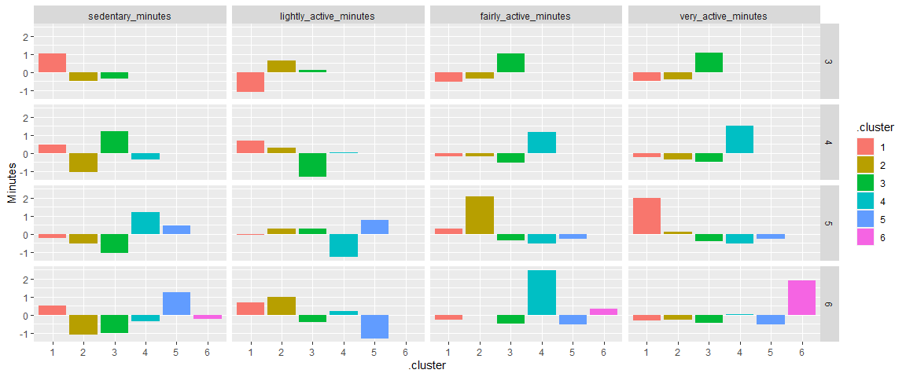
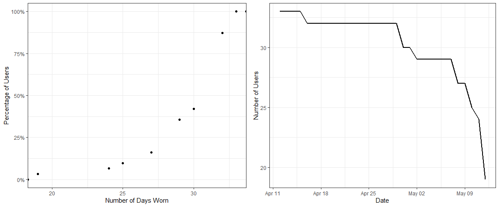
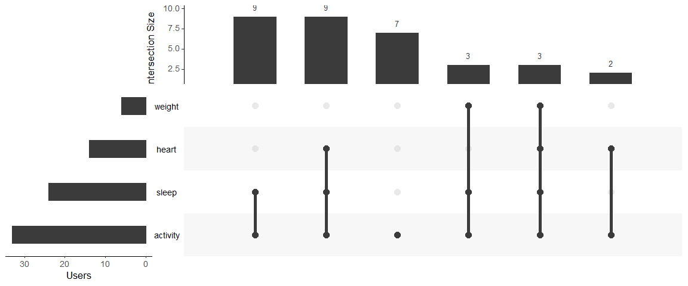
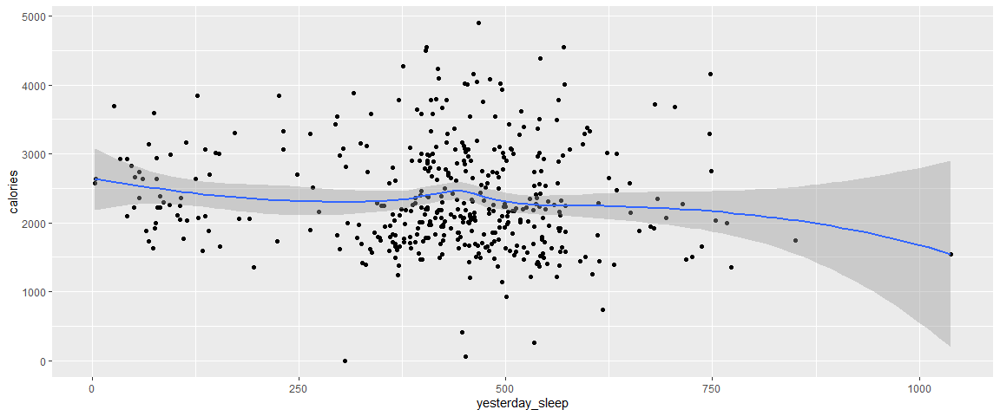

# Ask

## Case Study Briefing

### Scenario

You are a junior data analyst working on the marketing analyst team at Bellabeat, a high-tech manufacturer of health-focused products for women. Bellabeat is a successful small company, but they have the potential to become a larger player in the global smart device market. Urška Sršen, cofounder and Chief Creative Officer of Bellabeat, believes that analyzing smart device fitness data could help unlock new growth opportunities for the company. You have been asked to focus on one of Bellabeat's products and analyze smart device data to gain insight into how consumers are using their smart devices. The insights you discover will then help guide marketing strategy for the company. You will present your analysis to the Bellabeat executive team along with your high-level recommendations for Bellabeat's marketing strategy

### Characters and Products

#### Characters

-   **Urška Sršen:** Bellabeat's cofounder and Chief Creative Officer

-   **Sando Mur:** Mathematician and Bellabeat's cofounder; key member of the Bellabeat executive team.

-   **Bellabeat marketing analytics team:** A team of data analysts responsible for collecting, analyzing, and reporting data that helps guide Bellabeat's marketing strategy. You joined this team six months ago and have been busy learning about Bellabeat''s mission and business goals --- as well as how you, as a junior data analyst, can help Bellabeat achieve them.

#### Products

-   **Bellabeat app:** The Bellabeat app provides users with health data related to their activity, sleep, stress, menstrual cycle, and mindfulness habits. This data can help users better understand their current habits and make healthy decisions. The Bellabeat app connects to their line of smart wellness products.

-   **Leaf:** Bellabeat's classic wellness tracker can be worn as a bracelet, necklace, or clip. The Leaf tracker connects to the Bellabeat app to track activity, sleep, and stress.

-   **Time:** This wellness watch combines the timeless look of a classic timepiece with smart technology to track user activity, sleep, and stress. The Time watch connects to the Bellabeat app to provide you with insights into your daily wellness.

-   **Spring:** This is a water bottle that tracks daily water intake using smart technology to ensure that you are appropriately hydrated throughout the day. The Spring bottle connects to the Bellabeat app to track your hydration levels.

-   **Bellabeat membership:** Bellabeat also offers a subscription-based membership program for users. Membership gives users 24/7 access to fully personalized guidance on nutrition, activity, sleep, health and beauty, and mindfulness based on their lifestyle and goals.

### About the Company

Urška Sršen and Sando Mur founded Bellabeat, a high-tech company that manufactures health-focused smart products. Sršen used her background as an artist to develop beautifully designed technology that informs and inspires women around the world. Collecting data on activity, sleep, stress, and reproductive health has allowed Bellabeat to empower women with knowledge about their own health and habits. Since it was founded in 2013, Bellabeat has grown rapidly and quickly positioned itself as a tech-driven wellness company for women.

By 2016, Bellabeat had opened offices around the world and launched multiple products. Bellabeat products became available through a growing number of online retailers in addition to their own e-commerce channel on their website. The company has invested in traditional advertising media, such as radio, out-of-home billboards, print, and television, but focuses on digital marketing extensively. Bellabeat invests year-round in Google Search, maintaining active Facebook and Instagram pages, and consistently engages consumers on Twitter. Additionally, Bellabeat runs video ads on Youtube and display ads on the Google Display Network to support campaigns around key marketing dates. Sršen knows that an analysis of Bellabeat's available consumer data would reveal more opportunities for growth. She has asked the marketing analytics team to focus on a Bellabeat product and analyze smart device usage data in order to gain insight into how people are already using their smart devices. Then, using this information, she would like high-level recommendations for how these trends can inform Bellabeat marketing strategy.

## The Business Task

-   To identify trends in usage of activity trackers and their associated apps.

-   Recommend features and inform marketing strategy to give Bellabeat a competitive advantage and to increase market share.

### Key Questions

-   What are the trends in usage of the the trackers?
-   Are there correlations between sleep, activity and calories burned?
-   What features would improve user experience whilst also promoting better health?
-   Which features should be the focus of the marketing strategy?

# Prepare

## Data Sources

Where was the data stored?

[FitBit Fitness Tracker Data](https://www.kaggle.com/arashnic/fitbit) (CC0: Public Domain, dataset made available through [Mobius](https://www.kaggle.com/arashnic)): This Kaggle data set contains personal fitness tracker from thirty fitbit users. Thirty eligible Fitbit users consented to the submission of personal tracker data, including minute-level output for physical activity, heart rate, and sleep monitoring. It includes information about daily activity, steps, and heart rate that can be used to explore users' habits.

## Data Import and Store

### Importing Data

1.  List Files in Directory


```r
library(data.table)
files <- list.files(path = "data", full.names = T)
files
```

```
##  [1] "data/dailyActivity_merged.csv"          
##  [2] "data/dailyCalories_merged.csv"          
##  [3] "data/dailyIntensities_merged.csv"       
##  [4] "data/dailySteps_merged.csv"             
##  [5] "data/heartrate_seconds_merged.csv"      
##  [6] "data/hourlyCalories_merged.csv"         
##  [7] "data/hourlyIntensities_merged.csv"      
##  [8] "data/hourlySteps_merged.csv"            
##  [9] "data/minuteCaloriesNarrow_merged.csv"   
## [10] "data/minuteCaloriesWide_merged.csv"     
## [11] "data/minuteIntensitiesNarrow_merged.csv"
## [12] "data/minuteIntensitiesWide_merged.csv"  
## [13] "data/minuteMETsNarrow_merged.csv"       
## [14] "data/minuteSleep_merged.csv"            
## [15] "data/minuteStepsNarrow_merged.csv"      
## [16] "data/minuteStepsWide_merged.csv"        
## [17] "data/sleepDay_merged.csv"               
## [18] "data/weightLogInfo_merged.csv"
```

2.  Remove `minutes` and `Wide` tables as they they are replicated in `hourly` and `Narrow` tables respectively. `` dailyCalories, `dailySteps` `` and `dailyIntensities` are also duplicated in `dailyActivity`. Keep `minuteSleep` for extra data on sleep stages.


```r
files <-files[grep("(hourly|dailyA|weight|sleepD|minuteSl|heart)", files, invert = FALSE)]
files
```

```
## [1] "data/dailyActivity_merged.csv"     "data/heartrate_seconds_merged.csv"
## [3] "data/hourlyCalories_merged.csv"    "data/hourlyIntensities_merged.csv"
## [5] "data/hourlySteps_merged.csv"       "data/minuteSleep_merged.csv"      
## [7] "data/sleepDay_merged.csv"          "data/weightLogInfo_merged.csv"
```

3.  Extract Table Names from path

4.  Read in all files to a list of tables

5.  Clean the column names of the nested tables

6.  Assign each table as a separate variable


```r
library(janitor)
tablenames <- gsub("(.*/)(.*)(_.*)", r"(\2)", files)
l <- lapply(files, fread, sep = ",", na.strings = c(""))
l <- lapply(l,clean_names)
for (row in 1:length(tablenames)) {
  assign(tablenames[row], l[[row]])
}
```

### Daily Data

In all cases below, date will need to be parsed from a character variable and `Id` as a factor variable. Given that there are fewer users in the sleep and weight tables, `Id` should be parsed after merging.

> Note: This data is in a tidy format,with one observational unit being a single user per date.


```r
library(funModeling)
df_status(dailyActivity)
```

```
##                      variable q_zeros p_zeros q_na p_na q_inf p_inf      type
## 1                          id       0    0.00    0    0     0     0 integer64
## 2               activity_date       0    0.00    0    0     0     0 character
## 3                 total_steps      77    8.19    0    0     0     0   integer
## 4              total_distance      78    8.30    0    0     0     0   numeric
## 5            tracker_distance      78    8.30    0    0     0     0   numeric
## 6  logged_activities_distance     908   96.60    0    0     0     0   numeric
## 7        very_active_distance     413   43.94    0    0     0     0   numeric
## 8  moderately_active_distance     386   41.06    0    0     0     0   numeric
## 9       light_active_distance      85    9.04    0    0     0     0   numeric
## 10  sedentary_active_distance     858   91.28    0    0     0     0   numeric
## 11        very_active_minutes     409   43.51    0    0     0     0   integer
## 12      fairly_active_minutes     384   40.85    0    0     0     0   integer
## 13     lightly_active_minutes      84    8.94    0    0     0     0   integer
## 14          sedentary_minutes       1    0.11    0    0     0     0   integer
## 15                   calories       4    0.43    0    0     0     0   integer
##    unique
## 1      33
## 2      31
## 3     842
## 4     615
## 5     613
## 6      19
## 7     333
## 8     211
## 9     491
## 10      9
## 11    122
## 12     81
## 13    335
## 14    549
## 15    734
```

```r
head(dailyActivity)
```

<div data-pagedtable="false">
  <script data-pagedtable-source type="application/json">
{"columns":[{"label":["id"],"name":[1],"type":["int64"],"align":["right"]},{"label":["activity_date"],"name":[2],"type":["chr"],"align":["left"]},{"label":["total_steps"],"name":[3],"type":["int"],"align":["right"]},{"label":["total_distance"],"name":[4],"type":["dbl"],"align":["right"]},{"label":["tracker_distance"],"name":[5],"type":["dbl"],"align":["right"]},{"label":["logged_activities_distance"],"name":[6],"type":["dbl"],"align":["right"]},{"label":["very_active_distance"],"name":[7],"type":["dbl"],"align":["right"]},{"label":["moderately_active_distance"],"name":[8],"type":["dbl"],"align":["right"]},{"label":["light_active_distance"],"name":[9],"type":["dbl"],"align":["right"]},{"label":["sedentary_active_distance"],"name":[10],"type":["dbl"],"align":["right"]},{"label":["very_active_minutes"],"name":[11],"type":["int"],"align":["right"]},{"label":["fairly_active_minutes"],"name":[12],"type":["int"],"align":["right"]},{"label":["lightly_active_minutes"],"name":[13],"type":["int"],"align":["right"]},{"label":["sedentary_minutes"],"name":[14],"type":["int"],"align":["right"]},{"label":["calories"],"name":[15],"type":["int"],"align":["right"]}],"data":[{"1":"1503960366","2":"4/12/2016","3":"13162","4":"8.50","5":"8.50","6":"0","7":"1.88","8":"0.55","9":"6.06","10":"0","11":"25","12":"13","13":"328","14":"728","15":"1985"},{"1":"1503960366","2":"4/13/2016","3":"10735","4":"6.97","5":"6.97","6":"0","7":"1.57","8":"0.69","9":"4.71","10":"0","11":"21","12":"19","13":"217","14":"776","15":"1797"},{"1":"1503960366","2":"4/14/2016","3":"10460","4":"6.74","5":"6.74","6":"0","7":"2.44","8":"0.40","9":"3.91","10":"0","11":"30","12":"11","13":"181","14":"1218","15":"1776"},{"1":"1503960366","2":"4/15/2016","3":"9762","4":"6.28","5":"6.28","6":"0","7":"2.14","8":"1.26","9":"2.83","10":"0","11":"29","12":"34","13":"209","14":"726","15":"1745"},{"1":"1503960366","2":"4/16/2016","3":"12669","4":"8.16","5":"8.16","6":"0","7":"2.71","8":"0.41","9":"5.04","10":"0","11":"36","12":"10","13":"221","14":"773","15":"1863"},{"1":"1503960366","2":"4/17/2016","3":"9705","4":"6.48","5":"6.48","6":"0","7":"3.19","8":"0.78","9":"2.51","10":"0","11":"38","12":"20","13":"164","14":"539","15":"1728"}],"options":{"columns":{"min":{},"max":[10]},"rows":{"min":[10],"max":[10]},"pages":{}}}
  </script>
</div>

All complete, showing activity of 33 users over 31 dates.


```r
df_status(sleepDay)
```

```
##               variable q_zeros p_zeros q_na p_na q_inf p_inf      type unique
## 1                   id       0       0    0    0     0     0 integer64     24
## 2            sleep_day       0       0    0    0     0     0 character     31
## 3  total_sleep_records       0       0    0    0     0     0   integer      3
## 4 total_minutes_asleep       0       0    0    0     0     0   integer    256
## 5    total_time_in_bed       0       0    0    0     0     0   integer    242
```

```r
head(sleepDay)
```

<div data-pagedtable="false">
  <script data-pagedtable-source type="application/json">
{"columns":[{"label":["id"],"name":[1],"type":["int64"],"align":["right"]},{"label":["sleep_day"],"name":[2],"type":["chr"],"align":["left"]},{"label":["total_sleep_records"],"name":[3],"type":["int"],"align":["right"]},{"label":["total_minutes_asleep"],"name":[4],"type":["int"],"align":["right"]},{"label":["total_time_in_bed"],"name":[5],"type":["int"],"align":["right"]}],"data":[{"1":"1503960366","2":"4/12/2016 12:00:00 AM","3":"1","4":"327","5":"346"},{"1":"1503960366","2":"4/13/2016 12:00:00 AM","3":"2","4":"384","5":"407"},{"1":"1503960366","2":"4/15/2016 12:00:00 AM","3":"1","4":"412","5":"442"},{"1":"1503960366","2":"4/16/2016 12:00:00 AM","3":"2","4":"340","5":"367"},{"1":"1503960366","2":"4/17/2016 12:00:00 AM","3":"1","4":"700","5":"712"},{"1":"1503960366","2":"4/19/2016 12:00:00 AM","3":"1","4":"304","5":"320"}],"options":{"columns":{"min":{},"max":[10]},"rows":{"min":[10],"max":[10]},"pages":{}}}
  </script>
</div>

24 users' sleep logs over 31 days. This appears to have been summarised from `minuteSleep`. No information on Sleep Type though, so will need to get from `minuteSleep`.


```r
df_status(weightLogInfo)
```

```
##           variable q_zeros p_zeros q_na  p_na q_inf p_inf      type unique
## 1               id       0    0.00    0  0.00     0     0 integer64      8
## 2             date       0    0.00    0  0.00     0     0 character     56
## 3        weight_kg       0    0.00    0  0.00     0     0   numeric     34
## 4    weight_pounds       0    0.00    0  0.00     0     0   numeric     34
## 5              fat       0    0.00   65 97.01     0     0   integer      2
## 6              bmi       0    0.00    0  0.00     0     0   numeric     36
## 7 is_manual_report      26   38.81    0  0.00     0     0   logical      2
## 8           log_id       0    0.00    0  0.00     0     0 integer64     56
```

```r
head(weightLogInfo)
```

<div data-pagedtable="false">
  <script data-pagedtable-source type="application/json">
{"columns":[{"label":["id"],"name":[1],"type":["int64"],"align":["right"]},{"label":["date"],"name":[2],"type":["chr"],"align":["left"]},{"label":["weight_kg"],"name":[3],"type":["dbl"],"align":["right"]},{"label":["weight_pounds"],"name":[4],"type":["dbl"],"align":["right"]},{"label":["fat"],"name":[5],"type":["int"],"align":["right"]},{"label":["bmi"],"name":[6],"type":["dbl"],"align":["right"]},{"label":["is_manual_report"],"name":[7],"type":["lgl"],"align":["right"]},{"label":["log_id"],"name":[8],"type":["int64"],"align":["right"]}],"data":[{"1":"1503960366","2":"5/2/2016 11:59:59 PM","3":"52.6","4":"115.9631","5":"22","6":"22.65","7":"TRUE","8":"1462233599000"},{"1":"1503960366","2":"5/3/2016 11:59:59 PM","3":"52.6","4":"115.9631","5":"NA","6":"22.65","7":"TRUE","8":"1462319999000"},{"1":"1927972279","2":"4/13/2016 1:08:52 AM","3":"133.5","4":"294.3171","5":"NA","6":"47.54","7":"FALSE","8":"1460509732000"},{"1":"2873212765","2":"4/21/2016 11:59:59 PM","3":"56.7","4":"125.0021","5":"NA","6":"21.45","7":"TRUE","8":"1461283199000"},{"1":"2873212765","2":"5/12/2016 11:59:59 PM","3":"57.3","4":"126.3249","5":"NA","6":"21.69","7":"TRUE","8":"1463097599000"},{"1":"4319703577","2":"4/17/2016 11:59:59 PM","3":"72.4","4":"159.6147","5":"25","6":"27.45","7":"TRUE","8":"1460937599000"}],"options":{"columns":{"min":{},"max":[10]},"rows":{"min":[10],"max":[10]},"pages":{}}}
  </script>
</div>

Weight logs of 8 unique users over 56 unique datetimes. This means we need to parse the date from this.

### Hourly Data

In all cases below, date and time will need to be parsed from a character variable. All three tables have 33 unique users and 736 unique hours so can be joined on these variables.

> Note: This data is in a tidy format,with one observational unit being a single user per hour.


```r
df_status(hourlyCalories)
```

```
##        variable q_zeros p_zeros q_na p_na q_inf p_inf      type unique
## 1            id       0       0    0    0     0     0 integer64     33
## 2 activity_hour       0       0    0    0     0     0 character    736
## 3      calories       0       0    0    0     0     0   integer    442
```

```r
head(hourlyCalories)
```

<div data-pagedtable="false">
  <script data-pagedtable-source type="application/json">
{"columns":[{"label":["id"],"name":[1],"type":["int64"],"align":["right"]},{"label":["activity_hour"],"name":[2],"type":["chr"],"align":["left"]},{"label":["calories"],"name":[3],"type":["int"],"align":["right"]}],"data":[{"1":"1503960366","2":"4/12/2016 12:00:00 AM","3":"81"},{"1":"1503960366","2":"4/12/2016 1:00:00 AM","3":"61"},{"1":"1503960366","2":"4/12/2016 2:00:00 AM","3":"59"},{"1":"1503960366","2":"4/12/2016 3:00:00 AM","3":"47"},{"1":"1503960366","2":"4/12/2016 4:00:00 AM","3":"48"},{"1":"1503960366","2":"4/12/2016 5:00:00 AM","3":"48"}],"options":{"columns":{"min":{},"max":[10]},"rows":{"min":[10],"max":[10]},"pages":{}}}
  </script>
</div>

Looks good.


```r
df_status(hourlyIntensities)
```

```
##            variable q_zeros p_zeros q_na p_na q_inf p_inf      type unique
## 1                id       0    0.00    0    0     0     0 integer64     33
## 2     activity_hour       0    0.00    0    0     0     0 character    736
## 3   total_intensity    9097   41.16    0    0     0     0   integer    175
## 4 average_intensity    9097   41.16    0    0     0     0   numeric    175
```

```r
head(hourlyIntensities)
```

<div data-pagedtable="false">
  <script data-pagedtable-source type="application/json">
{"columns":[{"label":["id"],"name":[1],"type":["int64"],"align":["right"]},{"label":["activity_hour"],"name":[2],"type":["chr"],"align":["left"]},{"label":["total_intensity"],"name":[3],"type":["int"],"align":["right"]},{"label":["average_intensity"],"name":[4],"type":["dbl"],"align":["right"]}],"data":[{"1":"1503960366","2":"4/12/2016 12:00:00 AM","3":"20","4":"0.333333"},{"1":"1503960366","2":"4/12/2016 1:00:00 AM","3":"8","4":"0.133333"},{"1":"1503960366","2":"4/12/2016 2:00:00 AM","3":"7","4":"0.116667"},{"1":"1503960366","2":"4/12/2016 3:00:00 AM","3":"0","4":"0.000000"},{"1":"1503960366","2":"4/12/2016 4:00:00 AM","3":"0","4":"0.000000"},{"1":"1503960366","2":"4/12/2016 5:00:00 AM","3":"0","4":"0.000000"}],"options":{"columns":{"min":{},"max":[10]},"rows":{"min":[10],"max":[10]},"pages":{}}}
  </script>
</div>

Looks good. It appears that total intensity is a weighted sum of `LightlyActiveMinutes`, `FairlyActiveMinutes` and `VeryActiveMinutes` from the `minuteIntensities` table, whereas `average_intensity` divides this by 60 to get a value per minute.


```r
df_status(hourlySteps)
```

```
##        variable q_zeros p_zeros q_na p_na q_inf p_inf      type unique
## 1            id       0    0.00    0    0     0     0 integer64     33
## 2 activity_hour       0    0.00    0    0     0     0 character    736
## 3    step_total    9297   42.07    0    0     0     0   integer   2222
```

```r
head(hourlySteps)
```

<div data-pagedtable="false">
  <script data-pagedtable-source type="application/json">
{"columns":[{"label":["id"],"name":[1],"type":["int64"],"align":["right"]},{"label":["activity_hour"],"name":[2],"type":["chr"],"align":["left"]},{"label":["step_total"],"name":[3],"type":["int"],"align":["right"]}],"data":[{"1":"1503960366","2":"4/12/2016 12:00:00 AM","3":"373"},{"1":"1503960366","2":"4/12/2016 1:00:00 AM","3":"160"},{"1":"1503960366","2":"4/12/2016 2:00:00 AM","3":"151"},{"1":"1503960366","2":"4/12/2016 3:00:00 AM","3":"0"},{"1":"1503960366","2":"4/12/2016 4:00:00 AM","3":"0"},{"1":"1503960366","2":"4/12/2016 5:00:00 AM","3":"0"}],"options":{"columns":{"min":{},"max":[10]},"rows":{"min":[10],"max":[10]},"pages":{}}}
  </script>
</div>

Looks good.

### Heart Rate


```r
df_status(heartrate_seconds)
```

```
##   variable q_zeros p_zeros q_na p_na q_inf p_inf      type unique
## 1       id       0       0    0    0     0     0 integer64     14
## 2     time       0       0    0    0     0     0 character 961274
## 3    value       0       0    0    0     0     0   integer    168
```

```r
head(heartrate_seconds)
```

<div data-pagedtable="false">
  <script data-pagedtable-source type="application/json">
{"columns":[{"label":["id"],"name":[1],"type":["int64"],"align":["right"]},{"label":["time"],"name":[2],"type":["chr"],"align":["left"]},{"label":["value"],"name":[3],"type":["int"],"align":["right"]}],"data":[{"1":"2022484408","2":"4/12/2016 7:21:00 AM","3":"97"},{"1":"2022484408","2":"4/12/2016 7:21:05 AM","3":"102"},{"1":"2022484408","2":"4/12/2016 7:21:10 AM","3":"105"},{"1":"2022484408","2":"4/12/2016 7:21:20 AM","3":"103"},{"1":"2022484408","2":"4/12/2016 7:21:25 AM","3":"101"},{"1":"2022484408","2":"4/12/2016 7:22:05 AM","3":"95"}],"options":{"columns":{"min":{},"max":[10]},"rows":{"min":[10],"max":[10]},"pages":{}}}
  </script>
</div>

Heart rate data looks good, but could be averaged by hour and joined with the hourly data.

> Note: This data is in a tidy format,with one observational unit being a single user per second.

### Sleep


```r
df_status(minuteSleep)
```

```
##   variable q_zeros p_zeros q_na p_na q_inf p_inf      type unique
## 1       id       0       0    0    0     0     0 integer64     24
## 2     date       0       0    0    0     0     0 character  49773
## 3    value       0       0    0    0     0     0   integer      3
## 4   log_id       0       0    0    0     0     0 integer64    459
```

```r
head(minuteSleep)
```

<div data-pagedtable="false">
  <script data-pagedtable-source type="application/json">
{"columns":[{"label":["id"],"name":[1],"type":["int64"],"align":["right"]},{"label":["date"],"name":[2],"type":["chr"],"align":["left"]},{"label":["value"],"name":[3],"type":["int"],"align":["right"]},{"label":["log_id"],"name":[4],"type":["int64"],"align":["right"]}],"data":[{"1":"1503960366","2":"4/12/2016 2:47:30 AM","3":"3","4":"11380564589"},{"1":"1503960366","2":"4/12/2016 2:48:30 AM","3":"2","4":"11380564589"},{"1":"1503960366","2":"4/12/2016 2:49:30 AM","3":"1","4":"11380564589"},{"1":"1503960366","2":"4/12/2016 2:50:30 AM","3":"1","4":"11380564589"},{"1":"1503960366","2":"4/12/2016 2:51:30 AM","3":"1","4":"11380564589"},{"1":"1503960366","2":"4/12/2016 2:52:30 AM","3":"1","4":"11380564589"}],"options":{"columns":{"min":{},"max":[10]},"rows":{"min":[10],"max":[10]},"pages":{}}}
  </script>
</div>

> Note: This data is in a tidy format,with one observational unit being a single user per minute.

The sleep data poses a few challenges.

1.  The `value` column identifies the type of sleep and this must be reflected in the data.

2.  It would be more useful to summarise this data into a wide format, with the minutes of each sleep type per day were recorded. This could then be merged with the daily tables.

3.  `total_minutes_asleep` from the `sleepDay` table does not appear to match with this table.

## Key Questions

Are there issues with bias or credibility in the data?

-   Reliable: The data was not particularly reliable. There were inconsistencies in the data collected but these were corrected to the best of my ability as described in the cleaning and wrangling sections.

-   Original: I cannot locate the original data source that was provided for this case study. It is a Kaggle repository with data offered by the public.

-   Comprehensive: The data is not comprehensive, this is a relatively small dataset and many tables have a lot of missing values, or just very few rows. This was also volunteered data from Fitbit users and so is neither a random sample, nor stratified in any way. IT would be dangerous to draw conclusions from this data alone.

-   Current: These data were collected in 2016 and the landscape of the fitness tracking industry has changed a lot in the last 6 years. It would be best to seek newer data.

-   Cited: I have cited the original source to the best of my knowledge above.

# Process

## Data Wrangling

### Sleep

I believe the problem arises as sleep events usually span midnight and therefore can occur on two separate dates. There are two potential ways to collate the `minuteSleep` data to make `sleepDay`:

1.  Add together the number of minutes of sleep per calendar date and record that. The observation unit would be minutes of sleep per `id` per `date`

2.  Add together the number of minutes of sleep per `id` per `log_id` and assign the date that the sleep event began as the `date`.

The second of these paradigms is far more complicated, so lets explore the first.


```r
minuteSleep[,date := lubridate::mdy_hms(date)]
minuteSleep[,date := lubridate::date(date)]
sleep1 <- minuteSleep[, .N, .(id,date)]
sleepDay[,sleep_day := lubridate::mdy_hms(sleep_day)]
sleepDay[,sleep_day := lubridate::date(sleep_day)]

head(sleepDay)
```

<div data-pagedtable="false">
  <script data-pagedtable-source type="application/json">
{"columns":[{"label":["id"],"name":[1],"type":["int64"],"align":["right"]},{"label":["sleep_day"],"name":[2],"type":["date"],"align":["right"]},{"label":["total_sleep_records"],"name":[3],"type":["int"],"align":["right"]},{"label":["total_minutes_asleep"],"name":[4],"type":["int"],"align":["right"]},{"label":["total_time_in_bed"],"name":[5],"type":["int"],"align":["right"]}],"data":[{"1":"1503960366","2":"2016-04-12","3":"1","4":"327","5":"346"},{"1":"1503960366","2":"2016-04-13","3":"2","4":"384","5":"407"},{"1":"1503960366","2":"2016-04-15","3":"1","4":"412","5":"442"},{"1":"1503960366","2":"2016-04-16","3":"2","4":"340","5":"367"},{"1":"1503960366","2":"2016-04-17","3":"1","4":"700","5":"712"},{"1":"1503960366","2":"2016-04-19","3":"1","4":"304","5":"320"}],"options":{"columns":{"min":{},"max":[10]},"rows":{"min":[10],"max":[10]},"pages":{}}}
  </script>
</div>

```r
head(sleep1)
```

<div data-pagedtable="false">
  <script data-pagedtable-source type="application/json">
{"columns":[{"label":["id"],"name":[1],"type":["int64"],"align":["right"]},{"label":["date"],"name":[2],"type":["date"],"align":["right"]},{"label":["N"],"name":[3],"type":["int"],"align":["right"]}],"data":[{"1":"1503960366","2":"2016-04-12","3":"346"},{"1":"1503960366","2":"2016-04-13","3":"407"},{"1":"1503960366","2":"2016-04-15","3":"442"},{"1":"1503960366","2":"2016-04-16","3":"400"},{"1":"1503960366","2":"2016-04-17","3":"679"},{"1":"1503960366","2":"2016-04-19","3":"320"}],"options":{"columns":{"min":{},"max":[10]},"rows":{"min":[10],"max":[10]},"pages":{}}}
  </script>
</div>

The new `sleep1` correlates quite well with `total_time_in_bed` but there are some discrepancies and also missing data in `sleepDay`. I will therefore replace `sleepDay` with my own summarised version of `minuteSleep`, which will provide transparency and coherence.


```r
# Overwrite original table
dailySleep <- dcast(minuteSleep,
      id + date ~ value)
dailySleep[, total_sleep := `1` + `2` + `3`]
setnames(dailySleep, c("1", "2", "3"), c("rem", "light", "deep"))
head(dailySleep)
```

<div data-pagedtable="false">
  <script data-pagedtable-source type="application/json">
{"columns":[{"label":["id"],"name":[1],"type":["int64"],"align":["right"]},{"label":["date"],"name":[2],"type":["date"],"align":["right"]},{"label":["rem"],"name":[3],"type":["int"],"align":["right"]},{"label":["light"],"name":[4],"type":["int"],"align":["right"]},{"label":["deep"],"name":[5],"type":["int"],"align":["right"]},{"label":["total_sleep"],"name":[6],"type":["int"],"align":["right"]}],"data":[{"1":"1503960366","2":"2016-04-12","3":"327","4":"13","5":"6","6":"346"},{"1":"1503960366","2":"2016-04-13","3":"384","4":"11","5":"12","6":"407"},{"1":"1503960366","2":"2016-04-15","3":"412","4":"22","5":"8","6":"442"},{"1":"1503960366","2":"2016-04-16","3":"372","4":"20","5":"8","6":"400"},{"1":"1503960366","2":"2016-04-17","3":"668","4":"11","5":"0","6":"679"},{"1":"1503960366","2":"2016-04-19","3":"304","4":"16","5":"0","6":"320"}],"options":{"columns":{"min":{},"max":[10]},"rows":{"min":[10],"max":[10]},"pages":{}}}
  </script>
</div>

The new `dailySleep` table shows the minutes of each day slept (for the longest period of sleep), and in which stages.

### Daily Data

1.  Parse datetimes.

2.  Set keys.

3.  Merge tables


```r
dailyActivity[,date := lubridate::mdy(activity_date)]
dailyActivity[,date := lubridate::date(date)][,activity_date :=NULL]
weightLogInfo[,date := lubridate::mdy_hms(date)]
weightLogInfo[,date := lubridate::date(date)]
setkeyv(dailySleep, c("id", "date"))
setkeyv(dailyActivity, c("id", "date"))
setkeyv(weightLogInfo, c("id", "date"))
daily <- weightLogInfo[dailySleep][dailyActivity]
daily[, id := factor(id)]
head(daily)
```

<div data-pagedtable="false">
  <script data-pagedtable-source type="application/json">
{"columns":[{"label":["id"],"name":[1],"type":["fct"],"align":["left"]},{"label":["date"],"name":[2],"type":["date"],"align":["right"]},{"label":["weight_kg"],"name":[3],"type":["dbl"],"align":["right"]},{"label":["weight_pounds"],"name":[4],"type":["dbl"],"align":["right"]},{"label":["fat"],"name":[5],"type":["int"],"align":["right"]},{"label":["bmi"],"name":[6],"type":["dbl"],"align":["right"]},{"label":["is_manual_report"],"name":[7],"type":["lgl"],"align":["right"]},{"label":["log_id"],"name":[8],"type":["int64"],"align":["right"]},{"label":["rem"],"name":[9],"type":["int"],"align":["right"]},{"label":["light"],"name":[10],"type":["int"],"align":["right"]},{"label":["deep"],"name":[11],"type":["int"],"align":["right"]},{"label":["total_sleep"],"name":[12],"type":["int"],"align":["right"]},{"label":["total_steps"],"name":[13],"type":["int"],"align":["right"]},{"label":["total_distance"],"name":[14],"type":["dbl"],"align":["right"]},{"label":["tracker_distance"],"name":[15],"type":["dbl"],"align":["right"]},{"label":["logged_activities_distance"],"name":[16],"type":["dbl"],"align":["right"]},{"label":["very_active_distance"],"name":[17],"type":["dbl"],"align":["right"]},{"label":["moderately_active_distance"],"name":[18],"type":["dbl"],"align":["right"]},{"label":["light_active_distance"],"name":[19],"type":["dbl"],"align":["right"]},{"label":["sedentary_active_distance"],"name":[20],"type":["dbl"],"align":["right"]},{"label":["very_active_minutes"],"name":[21],"type":["int"],"align":["right"]},{"label":["fairly_active_minutes"],"name":[22],"type":["int"],"align":["right"]},{"label":["lightly_active_minutes"],"name":[23],"type":["int"],"align":["right"]},{"label":["sedentary_minutes"],"name":[24],"type":["int"],"align":["right"]},{"label":["calories"],"name":[25],"type":["int"],"align":["right"]}],"data":[{"1":"1503960366","2":"2016-04-12","3":"NA","4":"NA","5":"NA","6":"NA","7":"NA","8":"NA","9":"327","10":"13","11":"6","12":"346","13":"13162","14":"8.50","15":"8.50","16":"0","17":"1.88","18":"0.55","19":"6.06","20":"0","21":"25","22":"13","23":"328","24":"728","25":"1985"},{"1":"1503960366","2":"2016-04-13","3":"NA","4":"NA","5":"NA","6":"NA","7":"NA","8":"NA","9":"384","10":"11","11":"12","12":"407","13":"10735","14":"6.97","15":"6.97","16":"0","17":"1.57","18":"0.69","19":"4.71","20":"0","21":"21","22":"19","23":"217","24":"776","25":"1797"},{"1":"1503960366","2":"2016-04-14","3":"NA","4":"NA","5":"NA","6":"NA","7":"NA","8":"NA","9":"NA","10":"NA","11":"NA","12":"NA","13":"10460","14":"6.74","15":"6.74","16":"0","17":"2.44","18":"0.40","19":"3.91","20":"0","21":"30","22":"11","23":"181","24":"1218","25":"1776"},{"1":"1503960366","2":"2016-04-15","3":"NA","4":"NA","5":"NA","6":"NA","7":"NA","8":"NA","9":"412","10":"22","11":"8","12":"442","13":"9762","14":"6.28","15":"6.28","16":"0","17":"2.14","18":"1.26","19":"2.83","20":"0","21":"29","22":"34","23":"209","24":"726","25":"1745"},{"1":"1503960366","2":"2016-04-16","3":"NA","4":"NA","5":"NA","6":"NA","7":"NA","8":"NA","9":"372","10":"20","11":"8","12":"400","13":"12669","14":"8.16","15":"8.16","16":"0","17":"2.71","18":"0.41","19":"5.04","20":"0","21":"36","22":"10","23":"221","24":"773","25":"1863"},{"1":"1503960366","2":"2016-04-17","3":"NA","4":"NA","5":"NA","6":"NA","7":"NA","8":"NA","9":"668","10":"11","11":"0","12":"679","13":"9705","14":"6.48","15":"6.48","16":"0","17":"3.19","18":"0.78","19":"2.51","20":"0","21":"38","22":"20","23":"164","24":"539","25":"1728"}],"options":{"columns":{"min":{},"max":[10]},"rows":{"min":[10],"max":[10]},"pages":{}}}
  </script>
</div>

### Hourly Data

Summarise heartrate by date, hour.


```r
heartrate_seconds[, datetime := lubridate::mdy_hms(time)]
heartrate_seconds[, date := lubridate::date(datetime)]
heartrate_seconds[, hour := lubridate::hour(datetime)][, time := NULL]
hourlyHeartrate <- unique(heartrate_seconds[,
                                            heartrate := as.integer(mean(value)),
                                            .(id, date, hour)][, .(id, date, hour, heartrate)])
head(hourlyHeartrate)
```

<div data-pagedtable="false">
  <script data-pagedtable-source type="application/json">
{"columns":[{"label":["id"],"name":[1],"type":["int64"],"align":["right"]},{"label":["date"],"name":[2],"type":["date"],"align":["right"]},{"label":["hour"],"name":[3],"type":["int"],"align":["right"]},{"label":["heartrate"],"name":[4],"type":["int"],"align":["right"]}],"data":[{"1":"2022484408","2":"2016-04-12","3":"7","4":"83"},{"1":"2022484408","2":"2016-04-12","3":"8","4":"68"},{"1":"2022484408","2":"2016-04-12","3":"9","4":"66"},{"1":"2022484408","2":"2016-04-12","3":"10","4":"106"},{"1":"2022484408","2":"2016-04-12","3":"11","4":"67"},{"1":"2022484408","2":"2016-04-12","3":"12","4":"66"}],"options":{"columns":{"min":{},"max":[10]},"rows":{"min":[10],"max":[10]},"pages":{}}}
  </script>
</div>

1.  Parse datetimes.

2.  Set keys.

3.  Merge tables


```r
hourlyCalories[, datetime := lubridate::mdy_hms(activity_hour)]
hourlyCalories[, date := lubridate::date(datetime)]
hourlyCalories[, hour := lubridate::hour(datetime)][, activity_hour := NULL][, datetime := NULL]
head(hourlyCalories)
```

<div data-pagedtable="false">
  <script data-pagedtable-source type="application/json">
{"columns":[{"label":["id"],"name":[1],"type":["int64"],"align":["right"]},{"label":["calories"],"name":[2],"type":["int"],"align":["right"]},{"label":["date"],"name":[3],"type":["date"],"align":["right"]},{"label":["hour"],"name":[4],"type":["int"],"align":["right"]}],"data":[{"1":"1503960366","2":"81","3":"2016-04-12","4":"0"},{"1":"1503960366","2":"61","3":"2016-04-12","4":"1"},{"1":"1503960366","2":"59","3":"2016-04-12","4":"2"},{"1":"1503960366","2":"47","3":"2016-04-12","4":"3"},{"1":"1503960366","2":"48","3":"2016-04-12","4":"4"},{"1":"1503960366","2":"48","3":"2016-04-12","4":"5"}],"options":{"columns":{"min":{},"max":[10]},"rows":{"min":[10],"max":[10]},"pages":{}}}
  </script>
</div>


```r
hourlyIntensities[, datetime := lubridate::mdy_hms(activity_hour)]
hourlyIntensities[, date := lubridate::date(datetime)]
hourlyIntensities[, hour := lubridate::hour(datetime)][, activity_hour := NULL][, datetime := NULL]
head(hourlyIntensities)
```

<div data-pagedtable="false">
  <script data-pagedtable-source type="application/json">
{"columns":[{"label":["id"],"name":[1],"type":["int64"],"align":["right"]},{"label":["total_intensity"],"name":[2],"type":["int"],"align":["right"]},{"label":["average_intensity"],"name":[3],"type":["dbl"],"align":["right"]},{"label":["date"],"name":[4],"type":["date"],"align":["right"]},{"label":["hour"],"name":[5],"type":["int"],"align":["right"]}],"data":[{"1":"1503960366","2":"20","3":"0.333333","4":"2016-04-12","5":"0"},{"1":"1503960366","2":"8","3":"0.133333","4":"2016-04-12","5":"1"},{"1":"1503960366","2":"7","3":"0.116667","4":"2016-04-12","5":"2"},{"1":"1503960366","2":"0","3":"0.000000","4":"2016-04-12","5":"3"},{"1":"1503960366","2":"0","3":"0.000000","4":"2016-04-12","5":"4"},{"1":"1503960366","2":"0","3":"0.000000","4":"2016-04-12","5":"5"}],"options":{"columns":{"min":{},"max":[10]},"rows":{"min":[10],"max":[10]},"pages":{}}}
  </script>
</div>


```r
hourlySteps[, datetime := lubridate::mdy_hms(activity_hour)]
hourlySteps[, date := lubridate::date(datetime)]
hourlySteps[, hour := lubridate::hour(datetime)][, activity_hour := NULL][, datetime := NULL]
head(hourlySteps)
```

<div data-pagedtable="false">
  <script data-pagedtable-source type="application/json">
{"columns":[{"label":["id"],"name":[1],"type":["int64"],"align":["right"]},{"label":["step_total"],"name":[2],"type":["int"],"align":["right"]},{"label":["date"],"name":[3],"type":["date"],"align":["right"]},{"label":["hour"],"name":[4],"type":["int"],"align":["right"]}],"data":[{"1":"1503960366","2":"373","3":"2016-04-12","4":"0"},{"1":"1503960366","2":"160","3":"2016-04-12","4":"1"},{"1":"1503960366","2":"151","3":"2016-04-12","4":"2"},{"1":"1503960366","2":"0","3":"2016-04-12","4":"3"},{"1":"1503960366","2":"0","3":"2016-04-12","4":"4"},{"1":"1503960366","2":"0","3":"2016-04-12","4":"5"}],"options":{"columns":{"min":{},"max":[10]},"rows":{"min":[10],"max":[10]},"pages":{}}}
  </script>
</div>


```r
setkeyv(hourlyCalories, c("id", "date", "hour"))
setkeyv(hourlyHeartrate, c("id", "date", "hour"))
setkeyv(hourlyIntensities, c("id", "date", "hour"))
setkeyv(hourlySteps, c("id", "date", "hour"))
hourly <- hourlyHeartrate[hourlyCalories][hourlyIntensities][hourlySteps]
hourly[, id := factor(id)]
# Tidy environment
rm(list=ls()[! ls() %in% c("daily","hourly")])
head(hourly)
```

<div data-pagedtable="false">
  <script data-pagedtable-source type="application/json">
{"columns":[{"label":["id"],"name":[1],"type":["fct"],"align":["left"]},{"label":["date"],"name":[2],"type":["date"],"align":["right"]},{"label":["hour"],"name":[3],"type":["int"],"align":["right"]},{"label":["heartrate"],"name":[4],"type":["int"],"align":["right"]},{"label":["calories"],"name":[5],"type":["int"],"align":["right"]},{"label":["total_intensity"],"name":[6],"type":["int"],"align":["right"]},{"label":["average_intensity"],"name":[7],"type":["dbl"],"align":["right"]},{"label":["step_total"],"name":[8],"type":["int"],"align":["right"]}],"data":[{"1":"1503960366","2":"2016-04-12","3":"0","4":"NA","5":"81","6":"20","7":"0.333333","8":"373"},{"1":"1503960366","2":"2016-04-12","3":"1","4":"NA","5":"61","6":"8","7":"0.133333","8":"160"},{"1":"1503960366","2":"2016-04-12","3":"2","4":"NA","5":"59","6":"7","7":"0.116667","8":"151"},{"1":"1503960366","2":"2016-04-12","3":"3","4":"NA","5":"47","6":"0","7":"0.000000","8":"0"},{"1":"1503960366","2":"2016-04-12","3":"4","4":"NA","5":"48","6":"0","7":"0.000000","8":"0"},{"1":"1503960366","2":"2016-04-12","3":"5","4":"NA","5":"48","6":"0","7":"0.000000","8":"0"}],"options":{"columns":{"min":{},"max":[10]},"rows":{"min":[10],"max":[10]},"pages":{}}}
  </script>
</div>

### Feature Engineering - User Type

Using `id` as a factor variable is useful, however, it would be good to split the users into groups based on their Activity to spot any trends is usage. I shall use k-means clustering to group the users

#### Normalisation

Select only the Activity Columns and then center and scale the data.


```r
library(tidyverse)
library(tidymodels)
activity <-
  daily %>%
  select(c(very_active_minutes:sedentary_minutes)) %>%
  mutate(across(.fns=scale))
head(activity)
```

<div data-pagedtable="false">
  <script data-pagedtable-source type="application/json">
{"columns":[{"label":["very_active_minutes"],"name":[1],"type":["dbl"],"align":["right"]},{"label":["fairly_active_minutes"],"name":[2],"type":["dbl"],"align":["right"]},{"label":["lightly_active_minutes"],"name":[3],"type":["dbl"],"align":["right"]},{"label":["sedentary_minutes"],"name":[4],"type":["dbl"],"align":["right"]}],"data":[{"1":"0.116764481","2":"-0.02826248","3":"1.2382652","4":"-0.8736777"},{"1":"-0.005020387","2":"0.27192658","3":"0.2215461","4":"-0.7143508"},{"1":"0.268995566","2":"-0.12832550","3":"-0.1082006","4":"0.7527842"},{"1":"0.238549349","2":"1.02239923","3":"0.1482691","4":"-0.8803163"},{"1":"0.451672868","2":"-0.17835701","3":"0.2581847","4":"-0.7243087"},{"1":"0.512565302","2":"0.32195809","3":"-0.2639143","4":"-1.5010273"}],"options":{"columns":{"min":{},"max":[10]},"rows":{"min":[10],"max":[10]},"pages":{}}}
  </script>
</div>

#### Try k = 3 : 7


```r
set.seed(1234)

kclusts <-
  tibble(k = 3:6) %>%
  mutate(
    kclust = map(k, ~kmeans(activity, .x)),
    tidied = map(kclust, tidy),
    glanced = map(kclust, glance),
    augmented = map(kclust, augment, activity)
    )

clusters <- 
  kclusts %>%
  unnest(cols = c(tidied))

assignments <- 
  kclusts %>% 
  unnest(cols = c(augmented))

clusterings <- 
  kclusts %>%
  unnest(cols = c(glanced))
```


```r
assignments %>%
  select(-c(kclust, tidied,glanced)) %>%
  group_by(k, .cluster) %>%
  mutate(.cluster = fct_reorder(.cluster, very_active_minutes)) %>%
  summarise(across(where(is.numeric), mean)) %>%
  pivot_longer(c(very_active_minutes:sedentary_minutes), names_to = "Lifestyle", values_to = "Minutes") %>%
  mutate(Lifestyle = fct_relevel(Lifestyle, c("sedentary_minutes", "lightly_active_minutes", "fairly_active_minutes", "very_active_minutes"))) %>%
  ggplot(aes(fill= .cluster, y = Minutes, x = .cluster)) +
  geom_col(position = "dodge") +
  facet_grid(k~Lifestyle)
```

<div class="figure" style="text-align: center">

<p class="caption">k = 3 appears to give the most coherent clusters in terms of user activity.</p>
</div>

#### Map Cluster to UserType

Double check that the Lifestyle assignments make sense.


```r
lifs <- assignments %>%
  filter(k == 3) %>%
  select(-c(k, kclust, tidied,glanced)) %>%
  mutate(.cluster = fct_reorder(.cluster, (very_active_minutes+fairly_active_minutes))) %>%
  pull(.cluster)

daily <- daily %>%
  mutate(
    Lifestyle = lifs,
    Lifestyle = fct_recode(Lifestyle,
                           "Sedentary" = "1",
                           "Fairly Active" = "2",
                           "Very Active" = "3")
  )
# Sanity Check
daily %>%
  select(c(very_active_minutes:sedentary_minutes),Lifestyle) %>%
  group_by(Lifestyle) %>%
  summarise(across(where(is.numeric), mean)) %>%
  arrange(very_active_minutes+fairly_active_minutes)
```

<div data-pagedtable="false">
  <script data-pagedtable-source type="application/json">
{"columns":[{"label":["Lifestyle"],"name":[1],"type":["fct"],"align":["left"]},{"label":["very_active_minutes"],"name":[2],"type":["dbl"],"align":["right"]},{"label":["fairly_active_minutes"],"name":[3],"type":["dbl"],"align":["right"]},{"label":["lightly_active_minutes"],"name":[4],"type":["dbl"],"align":["right"]},{"label":["sedentary_minutes"],"name":[5],"type":["dbl"],"align":["right"]}],"data":[{"1":"Sedentary","2":"5.557621","3":"3.401487","4":"74.05204","5":"1306.8364"},{"1":"Fairly Active","2":"7.782178","3":"6.814356","4":"262.04208","5":"846.8762"},{"1":"Very Active","2":"57.138577","3":"34.018727","4":"207.71161","5":"891.6142"}],"options":{"columns":{"min":{},"max":[10]},"rows":{"min":[10],"max":[10]},"pages":{}}}
  </script>
</div>

```r
rm(list=ls()[! ls() %in% c("daily","hourly")])
head(daily)
```

<div data-pagedtable="false">
  <script data-pagedtable-source type="application/json">
{"columns":[{"label":["id"],"name":[1],"type":["fct"],"align":["left"]},{"label":["date"],"name":[2],"type":["date"],"align":["right"]},{"label":["weight_kg"],"name":[3],"type":["dbl"],"align":["right"]},{"label":["weight_pounds"],"name":[4],"type":["dbl"],"align":["right"]},{"label":["fat"],"name":[5],"type":["int"],"align":["right"]},{"label":["bmi"],"name":[6],"type":["dbl"],"align":["right"]},{"label":["is_manual_report"],"name":[7],"type":["lgl"],"align":["right"]},{"label":["log_id"],"name":[8],"type":["int64"],"align":["right"]},{"label":["rem"],"name":[9],"type":["int"],"align":["right"]},{"label":["light"],"name":[10],"type":["int"],"align":["right"]},{"label":["deep"],"name":[11],"type":["int"],"align":["right"]},{"label":["total_sleep"],"name":[12],"type":["int"],"align":["right"]},{"label":["total_steps"],"name":[13],"type":["int"],"align":["right"]},{"label":["total_distance"],"name":[14],"type":["dbl"],"align":["right"]},{"label":["tracker_distance"],"name":[15],"type":["dbl"],"align":["right"]},{"label":["logged_activities_distance"],"name":[16],"type":["dbl"],"align":["right"]},{"label":["very_active_distance"],"name":[17],"type":["dbl"],"align":["right"]},{"label":["moderately_active_distance"],"name":[18],"type":["dbl"],"align":["right"]},{"label":["light_active_distance"],"name":[19],"type":["dbl"],"align":["right"]},{"label":["sedentary_active_distance"],"name":[20],"type":["dbl"],"align":["right"]},{"label":["very_active_minutes"],"name":[21],"type":["int"],"align":["right"]},{"label":["fairly_active_minutes"],"name":[22],"type":["int"],"align":["right"]},{"label":["lightly_active_minutes"],"name":[23],"type":["int"],"align":["right"]},{"label":["sedentary_minutes"],"name":[24],"type":["int"],"align":["right"]},{"label":["calories"],"name":[25],"type":["int"],"align":["right"]},{"label":["Lifestyle"],"name":[26],"type":["fct"],"align":["left"]}],"data":[{"1":"1503960366","2":"2016-04-12","3":"NA","4":"NA","5":"NA","6":"NA","7":"NA","8":"NA","9":"327","10":"13","11":"6","12":"346","13":"13162","14":"8.50","15":"8.50","16":"0","17":"1.88","18":"0.55","19":"6.06","20":"0","21":"25","22":"13","23":"328","24":"728","25":"1985","26":"Fairly Active"},{"1":"1503960366","2":"2016-04-13","3":"NA","4":"NA","5":"NA","6":"NA","7":"NA","8":"NA","9":"384","10":"11","11":"12","12":"407","13":"10735","14":"6.97","15":"6.97","16":"0","17":"1.57","18":"0.69","19":"4.71","20":"0","21":"21","22":"19","23":"217","24":"776","25":"1797","26":"Fairly Active"},{"1":"1503960366","2":"2016-04-14","3":"NA","4":"NA","5":"NA","6":"NA","7":"NA","8":"NA","9":"NA","10":"NA","11":"NA","12":"NA","13":"10460","14":"6.74","15":"6.74","16":"0","17":"2.44","18":"0.40","19":"3.91","20":"0","21":"30","22":"11","23":"181","24":"1218","25":"1776","26":"Sedentary"},{"1":"1503960366","2":"2016-04-15","3":"NA","4":"NA","5":"NA","6":"NA","7":"NA","8":"NA","9":"412","10":"22","11":"8","12":"442","13":"9762","14":"6.28","15":"6.28","16":"0","17":"2.14","18":"1.26","19":"2.83","20":"0","21":"29","22":"34","23":"209","24":"726","25":"1745","26":"Very Active"},{"1":"1503960366","2":"2016-04-16","3":"NA","4":"NA","5":"NA","6":"NA","7":"NA","8":"NA","9":"372","10":"20","11":"8","12":"400","13":"12669","14":"8.16","15":"8.16","16":"0","17":"2.71","18":"0.41","19":"5.04","20":"0","21":"36","22":"10","23":"221","24":"773","25":"1863","26":"Fairly Active"},{"1":"1503960366","2":"2016-04-17","3":"NA","4":"NA","5":"NA","6":"NA","7":"NA","8":"NA","9":"668","10":"11","11":"0","12":"679","13":"9705","14":"6.48","15":"6.48","16":"0","17":"3.19","18":"0.78","19":"2.51","20":"0","21":"38","22":"20","23":"164","24":"539","25":"1728","26":"Very Active"}],"options":{"columns":{"min":{},"max":[10]},"rows":{"min":[10],"max":[10]},"pages":{}}}
  </script>
</div>

## Key Questions

### What tools are you choosing and why?

I chose R and data.table as these allow for efficient processing and visualisation. It also allows for me to document the analysis using Rmarkdown to produce a document that meets the requirements of "Reproducible Research".

# Analyse

## What are some trends in smart device usage?

### Which features are people using?

Let's see how many users use various combinations of the following features: activity (calories/steps), heartrate, weight and sleep tracking;


```r
library(ggplot2)
library(gridExtra)
library(plotly)
```

How many days did each user wear the tracker? Let's assume that if `Calories` \>0 then the tracker was worn.


```r
df <- daily[calories > 0,.N,by = .(date)]
p1 <-
  ggplot(data = df, aes(x = N)) +
  stat_ecdf(geom = "point") +
  labs(x = "Number of Days Worn",
       y = "Percentage of Users") +
  scale_y_continuous(labels =  scales::percent_format()) +
  theme_bw()

p2 <-
  ggplot(data = df, aes(x = `date`, y = N)) +
  geom_line(size = 1) +
  labs(x = "Date", y = "Number of Users") +
  theme_bw()

grid.arrange(p1,p2, nrow = 1)
```

<div class="figure" style="text-align: center">

<p class="caption">Most users wore the device for 30-32 out of the 32 days measured. After 2 weeks, usage began to drop off.</p>
</div>

Lets investigate the number of users who logged their weight;


```r
df <- daily[!is.na(weight_kg), .N, by = .(date, id)]
ggplotly(
  ggplot(data = df, aes(x = date, y = N, fill = id)) +
  geom_col(show.legend = FALSE) +
  labs(x = "Date", y = "Users") +
  theme_minimal()
)
```

<div class="figure" style="text-align: center">

```{=html}
<div id="htmlwidget-7db73d03839427d3b7c2" style="width:1152px;height:480px;" class="plotly html-widget"></div>
<script type="application/json" data-for="htmlwidget-7db73d03839427d3b7c2">{"x":{"data":[{"orientation":"v","width":[0.900000000001455,0.900000000001455],"base":[1,1],"x":[16923,16924],"y":[1,1],"text":["date: 2016-05-02<br />N: 1<br />id: 1503960366","date: 2016-05-03<br />N: 1<br />id: 1503960366"],"type":"bar","textposition":"none","marker":{"autocolorscale":false,"color":"rgba(248,118,109,1)","line":{"width":1.88976377952756,"color":"transparent"}},"name":"1503960366","legendgroup":"1503960366","showlegend":true,"xaxis":"x","yaxis":"y","hoverinfo":"text","frame":null},{"orientation":"v","width":0.900000000001455,"base":1,"x":[16904],"y":[1],"text":"date: 2016-04-13<br />N: 1<br />id: 1927972279","type":"bar","textposition":"none","marker":{"autocolorscale":false,"color":"rgba(183,159,0,1)","line":{"width":1.88976377952756,"color":"transparent"}},"name":"1927972279","legendgroup":"1927972279","showlegend":true,"xaxis":"x","yaxis":"y","hoverinfo":"text","frame":null},{"orientation":"v","width":0.900000000001455,"base":2,"x":[16908],"y":[1],"text":"date: 2016-04-17<br />N: 1<br />id: 4319703577","type":"bar","textposition":"none","marker":{"autocolorscale":false,"color":"rgba(0,186,56,1)","line":{"width":1.88976377952756,"color":"transparent"}},"name":"4319703577","legendgroup":"4319703577","showlegend":true,"xaxis":"x","yaxis":"y","hoverinfo":"text","frame":null},{"orientation":"v","width":[0.900000000001455,0.900000000001455],"base":[1,1],"x":[16916,16922],"y":[1,1],"text":["date: 2016-04-25<br />N: 1<br />id: 4558609924","date: 2016-05-01<br />N: 1<br />id: 4558609924"],"type":"bar","textposition":"none","marker":{"autocolorscale":false,"color":"rgba(0,191,196,1)","line":{"width":1.88976377952756,"color":"transparent"}},"name":"4558609924","legendgroup":"4558609924","showlegend":true,"xaxis":"x","yaxis":"y","hoverinfo":"text","frame":null},{"orientation":"v","width":0.900000000001455,"base":1,"x":[16908],"y":[1],"text":"date: 2016-04-17<br />N: 1<br />id: 5577150313","type":"bar","textposition":"none","marker":{"autocolorscale":false,"color":"rgba(97,156,255,1)","line":{"width":1.88976377952756,"color":"transparent"}},"name":"5577150313","legendgroup":"5577150313","showlegend":true,"xaxis":"x","yaxis":"y","hoverinfo":"text","frame":null},{"orientation":"v","width":[0.900000000001455,0.900000000001455,0.900000000001455,0.900000000001455,0.900000000001455,0.900000000001455,0.900000000001455,0.900000000001455,0.900000000001455,0.900000000001455,0.900000000001455,0.900000000001455,0.900000000001455,0.900000000001455,0.900000000001455,0.900000000001455,0.900000000001455,0.900000000001455,0.900000000001455,0.900000000001455,0.900000000001455,0.900000000001455,0.900000000001455,0.900000000001455,0.900000000001455,0.900000000001455,0.900000000001455,0.900000000001455,0.900000000001455,0.900000000001455],"base":[0,0,0,0,0,0,0,0,0,0,0,0,0,0,0,0,0,0,0,0,0,0,0,0,0,0,0,0,0,0],"x":[16903,16904,16905,16906,16907,16908,16909,16910,16911,16912,16913,16914,16915,16916,16918,16919,16920,16921,16922,16923,16924,16925,16926,16927,16928,16929,16930,16931,16932,16933],"y":[1,1,1,1,1,1,1,1,1,1,1,1,1,1,1,1,1,1,1,1,1,1,1,1,1,1,1,1,1,1],"text":["date: 2016-04-12<br />N: 1<br />id: 6962181067","date: 2016-04-13<br />N: 1<br />id: 6962181067","date: 2016-04-14<br />N: 1<br />id: 6962181067","date: 2016-04-15<br />N: 1<br />id: 6962181067","date: 2016-04-16<br />N: 1<br />id: 6962181067","date: 2016-04-17<br />N: 1<br />id: 6962181067","date: 2016-04-18<br />N: 1<br />id: 6962181067","date: 2016-04-19<br />N: 1<br />id: 6962181067","date: 2016-04-20<br />N: 1<br />id: 6962181067","date: 2016-04-21<br />N: 1<br />id: 6962181067","date: 2016-04-22<br />N: 1<br />id: 6962181067","date: 2016-04-23<br />N: 1<br />id: 6962181067","date: 2016-04-24<br />N: 1<br />id: 6962181067","date: 2016-04-25<br />N: 1<br />id: 6962181067","date: 2016-04-27<br />N: 1<br />id: 6962181067","date: 2016-04-28<br />N: 1<br />id: 6962181067","date: 2016-04-29<br />N: 1<br />id: 6962181067","date: 2016-04-30<br />N: 1<br />id: 6962181067","date: 2016-05-01<br />N: 1<br />id: 6962181067","date: 2016-05-02<br />N: 1<br />id: 6962181067","date: 2016-05-03<br />N: 1<br />id: 6962181067","date: 2016-05-04<br />N: 1<br />id: 6962181067","date: 2016-05-05<br />N: 1<br />id: 6962181067","date: 2016-05-06<br />N: 1<br />id: 6962181067","date: 2016-05-07<br />N: 1<br />id: 6962181067","date: 2016-05-08<br />N: 1<br />id: 6962181067","date: 2016-05-09<br />N: 1<br />id: 6962181067","date: 2016-05-10<br />N: 1<br />id: 6962181067","date: 2016-05-11<br />N: 1<br />id: 6962181067","date: 2016-05-12<br />N: 1<br />id: 6962181067"],"type":"bar","textposition":"none","marker":{"autocolorscale":false,"color":"rgba(245,100,227,1)","line":{"width":1.88976377952756,"color":"transparent"}},"name":"6962181067","legendgroup":"6962181067","showlegend":true,"xaxis":"x","yaxis":"y","hoverinfo":"text","frame":null}],"layout":{"margin":{"t":33.5342465753425,"r":7.30593607305936,"b":47.4885844748859,"l":31.4155251141553},"font":{"color":"rgba(0,0,0,1)","family":"","size":14.6118721461187},"xaxis":{"domain":[0,1],"automargin":true,"type":"linear","autorange":false,"range":[16901.005,16934.995],"tickmode":"array","ticktext":["Apr 11","Apr 18","Apr 25","May 02","May 09"],"tickvals":[16902,16909,16916,16923,16930],"categoryorder":"array","categoryarray":["Apr 11","Apr 18","Apr 25","May 02","May 09"],"nticks":null,"ticks":"","tickcolor":null,"ticklen":3.65296803652968,"tickwidth":0,"showticklabels":true,"tickfont":{"color":"rgba(77,77,77,1)","family":"","size":11.689497716895},"tickangle":-0,"showline":false,"linecolor":null,"linewidth":0,"showgrid":true,"gridcolor":"rgba(235,235,235,1)","gridwidth":0.66417600664176,"zeroline":false,"anchor":"y","title":{"text":"Date","font":{"color":"rgba(0,0,0,1)","family":"","size":14.6118721461187}},"hoverformat":".2f"},"yaxis":{"domain":[0,1],"automargin":true,"type":"linear","autorange":false,"range":[-0.15,3.15],"tickmode":"array","ticktext":["0","1","2","3"],"tickvals":[0,1,2,3],"categoryorder":"array","categoryarray":["0","1","2","3"],"nticks":null,"ticks":"","tickcolor":null,"ticklen":3.65296803652968,"tickwidth":0,"showticklabels":true,"tickfont":{"color":"rgba(77,77,77,1)","family":"","size":11.689497716895},"tickangle":-0,"showline":false,"linecolor":null,"linewidth":0,"showgrid":true,"gridcolor":"rgba(235,235,235,1)","gridwidth":0.66417600664176,"zeroline":false,"anchor":"x","title":{"text":"Users","font":{"color":"rgba(0,0,0,1)","family":"","size":14.6118721461187}},"hoverformat":".2f"},"shapes":[{"type":"rect","fillcolor":null,"line":{"color":null,"width":0,"linetype":[]},"yref":"paper","xref":"paper","x0":0,"x1":1,"y0":0,"y1":1}],"showlegend":true,"legend":{"bgcolor":null,"bordercolor":null,"borderwidth":0,"font":{"color":"rgba(0,0,0,1)","family":"","size":11.689497716895},"title":{"text":"","font":{"color":"rgba(0,0,0,1)","family":"","size":14.6118721461187}}},"hovermode":"closest","barmode":"relative"},"config":{"doubleClick":"reset","modeBarButtonsToAdd":["hoverclosest","hovercompare"],"showSendToCloud":false},"source":"A","attrs":{"59b48f15f2b":{"x":{},"y":{},"fill":{},"type":"bar"}},"cur_data":"59b48f15f2b","visdat":{"59b48f15f2b":["function (y) ","x"]},"highlight":{"on":"plotly_click","persistent":false,"dynamic":false,"selectize":false,"opacityDim":0.2,"selected":{"opacity":1},"debounce":0},"shinyEvents":["plotly_hover","plotly_click","plotly_selected","plotly_relayout","plotly_brushed","plotly_brushing","plotly_clickannotation","plotly_doubleclick","plotly_deselect","plotly_afterplot","plotly_sunburstclick"],"base_url":"https://plot.ly"},"evals":[],"jsHooks":[]}</script>
```

<p class="caption">5/33 users logged their weight.</p>
</div>

One user logged almost every day.


```r
df <- daily[!is.na(total_sleep),.N,.(date)]
ggplotly(
  ggplot(data = df, aes(x = N)) +
  stat_ecdf(geom = "point") +
  labs(x = "Number of Days Worn",
       y = "Percentage of Users") +
  scale_y_continuous(labels =  scales::percent_format()) +
  theme_bw()
)
```

<div class="figure" style="text-align: center">

```{=html}
<div id="htmlwidget-e3fede5c798441fdaea7" style="width:1152px;height:480px;" class="plotly html-widget"></div>
<script type="application/json" data-for="htmlwidget-e3fede5c798441fdaea7">{"x":{"data":[{"x":[null,14,15,17,13,16,12,11,8,null],"y":[0,0.516129032258065,0.741935483870968,1,0.32258064516129,0.903225806451613,0.129032258064516,0.0645161290322581,0.032258064516129,1],"text":["y: 0.00000000<br />N: -Inf","y: 0.51612903<br />N:   14","y: 0.74193548<br />N:   15","y: 1.00000000<br />N:   17","y: 0.32258065<br />N:   13","y: 0.90322581<br />N:   16","y: 0.12903226<br />N:   12","y: 0.06451613<br />N:   11","y: 0.03225806<br />N:    8","y: 1.00000000<br />N:  Inf"],"type":"scatter","mode":"markers","marker":{"autocolorscale":false,"color":"rgba(0,0,0,1)","opacity":1,"size":5.66929133858268,"symbol":"circle","line":{"width":1.88976377952756,"color":"rgba(0,0,0,1)"}},"hoveron":"points","showlegend":false,"xaxis":"x","yaxis":"y","hoverinfo":"text","frame":null}],"layout":{"margin":{"t":33.5342465753425,"r":7.30593607305936,"b":47.4885844748859,"l":48.9497716894977},"plot_bgcolor":"rgba(255,255,255,1)","paper_bgcolor":"rgba(255,255,255,1)","font":{"color":"rgba(0,0,0,1)","family":"","size":14.6118721461187},"xaxis":{"domain":[0,1],"automargin":true,"type":"linear","autorange":false,"range":[7.55,17.45],"tickmode":"array","ticktext":["10.0","12.5","15.0"],"tickvals":[10,12.5,15],"categoryorder":"array","categoryarray":["10.0","12.5","15.0"],"nticks":null,"ticks":"outside","tickcolor":"rgba(51,51,51,1)","ticklen":3.65296803652968,"tickwidth":0.66417600664176,"showticklabels":true,"tickfont":{"color":"rgba(77,77,77,1)","family":"","size":11.689497716895},"tickangle":-0,"showline":false,"linecolor":null,"linewidth":0,"showgrid":true,"gridcolor":"rgba(235,235,235,1)","gridwidth":0.66417600664176,"zeroline":false,"anchor":"y","title":{"text":"Number of Days Worn","font":{"color":"rgba(0,0,0,1)","family":"","size":14.6118721461187}},"hoverformat":".2f"},"yaxis":{"domain":[0,1],"automargin":true,"type":"linear","autorange":false,"range":[-0.05,1.05],"tickmode":"array","ticktext":["0%","25%","50%","75%","100%"],"tickvals":[0,0.25,0.5,0.75,1],"categoryorder":"array","categoryarray":["0%","25%","50%","75%","100%"],"nticks":null,"ticks":"outside","tickcolor":"rgba(51,51,51,1)","ticklen":3.65296803652968,"tickwidth":0.66417600664176,"showticklabels":true,"tickfont":{"color":"rgba(77,77,77,1)","family":"","size":11.689497716895},"tickangle":-0,"showline":false,"linecolor":null,"linewidth":0,"showgrid":true,"gridcolor":"rgba(235,235,235,1)","gridwidth":0.66417600664176,"zeroline":false,"anchor":"x","title":{"text":"Percentage of Users","font":{"color":"rgba(0,0,0,1)","family":"","size":14.6118721461187}},"hoverformat":".2f"},"shapes":[{"type":"rect","fillcolor":"transparent","line":{"color":"rgba(51,51,51,1)","width":0.66417600664176,"linetype":"solid"},"yref":"paper","xref":"paper","x0":0,"x1":1,"y0":0,"y1":1}],"showlegend":false,"legend":{"bgcolor":"rgba(255,255,255,1)","bordercolor":"transparent","borderwidth":1.88976377952756,"font":{"color":"rgba(0,0,0,1)","family":"","size":11.689497716895}},"hovermode":"closest","barmode":"relative"},"config":{"doubleClick":"reset","modeBarButtonsToAdd":["hoverclosest","hovercompare"],"showSendToCloud":false},"source":"A","attrs":{"59b4eb330ee":{"x":{},"type":"scatter"}},"cur_data":"59b4eb330ee","visdat":{"59b4eb330ee":["function (y) ","x"]},"highlight":{"on":"plotly_click","persistent":false,"dynamic":false,"selectize":false,"opacityDim":0.2,"selected":{"opacity":1},"debounce":0},"shinyEvents":["plotly_hover","plotly_click","plotly_selected","plotly_relayout","plotly_brushed","plotly_brushing","plotly_clickannotation","plotly_doubleclick","plotly_deselect","plotly_afterplot","plotly_sunburstclick"],"base_url":"https://plot.ly"},"evals":[],"jsHooks":[]}</script>
```

<p class="caption">No users logged their sleep for more than 17 days.</p>
</div>

```r
ggplotly(
  ggplot(data = df, aes(x = `date`, y = N)) +
  geom_line(size = 1) +
  labs(x = "Date", y = "Number of Users") +
  theme_bw()
)
```

<div class="figure" style="text-align: center">

```{=html}
<div id="htmlwidget-7ad32f6b82562872f5e3" style="width:1152px;height:480px;" class="plotly html-widget"></div>
<script type="application/json" data-for="htmlwidget-7ad32f6b82562872f5e3">{"x":{"data":[{"x":[16903,16904,16905,16906,16907,16908,16909,16910,16911,16912,16913,16914,16915,16916,16917,16918,16919,16920,16921,16922,16923,16924,16925,16926,16927,16928,16929,16930,16931,16932,16933],"y":[14,15,16,17,15,13,12,14,16,15,14,15,13,15,16,14,17,16,16,17,15,14,13,13,12,14,15,13,13,11,8],"text":["date: 2016-04-12<br />N: 14","date: 2016-04-13<br />N: 15","date: 2016-04-14<br />N: 16","date: 2016-04-15<br />N: 17","date: 2016-04-16<br />N: 15","date: 2016-04-17<br />N: 13","date: 2016-04-18<br />N: 12","date: 2016-04-19<br />N: 14","date: 2016-04-20<br />N: 16","date: 2016-04-21<br />N: 15","date: 2016-04-22<br />N: 14","date: 2016-04-23<br />N: 15","date: 2016-04-24<br />N: 13","date: 2016-04-25<br />N: 15","date: 2016-04-26<br />N: 16","date: 2016-04-27<br />N: 14","date: 2016-04-28<br />N: 17","date: 2016-04-29<br />N: 16","date: 2016-04-30<br />N: 16","date: 2016-05-01<br />N: 17","date: 2016-05-02<br />N: 15","date: 2016-05-03<br />N: 14","date: 2016-05-04<br />N: 13","date: 2016-05-05<br />N: 13","date: 2016-05-06<br />N: 12","date: 2016-05-07<br />N: 14","date: 2016-05-08<br />N: 15","date: 2016-05-09<br />N: 13","date: 2016-05-10<br />N: 13","date: 2016-05-11<br />N: 11","date: 2016-05-12<br />N:  8"],"type":"scatter","mode":"lines","line":{"width":3.77952755905512,"color":"rgba(0,0,0,1)","dash":"solid"},"hoveron":"points","showlegend":false,"xaxis":"x","yaxis":"y","hoverinfo":"text","frame":null}],"layout":{"margin":{"t":33.5342465753425,"r":7.30593607305936,"b":47.4885844748859,"l":48.9497716894977},"plot_bgcolor":"rgba(255,255,255,1)","paper_bgcolor":"rgba(255,255,255,1)","font":{"color":"rgba(0,0,0,1)","family":"","size":14.6118721461187},"xaxis":{"domain":[0,1],"automargin":true,"type":"linear","autorange":false,"range":[16901.5,16934.5],"tickmode":"array","ticktext":["Apr 11","Apr 18","Apr 25","May 02","May 09"],"tickvals":[16902,16909,16916,16923,16930],"categoryorder":"array","categoryarray":["Apr 11","Apr 18","Apr 25","May 02","May 09"],"nticks":null,"ticks":"outside","tickcolor":"rgba(51,51,51,1)","ticklen":3.65296803652968,"tickwidth":0.66417600664176,"showticklabels":true,"tickfont":{"color":"rgba(77,77,77,1)","family":"","size":11.689497716895},"tickangle":-0,"showline":false,"linecolor":null,"linewidth":0,"showgrid":true,"gridcolor":"rgba(235,235,235,1)","gridwidth":0.66417600664176,"zeroline":false,"anchor":"y","title":{"text":"Date","font":{"color":"rgba(0,0,0,1)","family":"","size":14.6118721461187}},"hoverformat":".2f"},"yaxis":{"domain":[0,1],"automargin":true,"type":"linear","autorange":false,"range":[7.55,17.45],"tickmode":"array","ticktext":["10.0","12.5","15.0"],"tickvals":[10,12.5,15],"categoryorder":"array","categoryarray":["10.0","12.5","15.0"],"nticks":null,"ticks":"outside","tickcolor":"rgba(51,51,51,1)","ticklen":3.65296803652968,"tickwidth":0.66417600664176,"showticklabels":true,"tickfont":{"color":"rgba(77,77,77,1)","family":"","size":11.689497716895},"tickangle":-0,"showline":false,"linecolor":null,"linewidth":0,"showgrid":true,"gridcolor":"rgba(235,235,235,1)","gridwidth":0.66417600664176,"zeroline":false,"anchor":"x","title":{"text":"Number of Users","font":{"color":"rgba(0,0,0,1)","family":"","size":14.6118721461187}},"hoverformat":".2f"},"shapes":[{"type":"rect","fillcolor":"transparent","line":{"color":"rgba(51,51,51,1)","width":0.66417600664176,"linetype":"solid"},"yref":"paper","xref":"paper","x0":0,"x1":1,"y0":0,"y1":1}],"showlegend":false,"legend":{"bgcolor":"rgba(255,255,255,1)","bordercolor":"transparent","borderwidth":1.88976377952756,"font":{"color":"rgba(0,0,0,1)","family":"","size":11.689497716895}},"hovermode":"closest","barmode":"relative"},"config":{"doubleClick":"reset","modeBarButtonsToAdd":["hoverclosest","hovercompare"],"showSendToCloud":false},"source":"A","attrs":{"59b440f0f18":{"x":{},"y":{},"type":"scatter"}},"cur_data":"59b440f0f18","visdat":{"59b440f0f18":["function (y) ","x"]},"highlight":{"on":"plotly_click","persistent":false,"dynamic":false,"selectize":false,"opacityDim":0.2,"selected":{"opacity":1},"debounce":0},"shinyEvents":["plotly_hover","plotly_click","plotly_selected","plotly_relayout","plotly_brushed","plotly_brushing","plotly_clickannotation","plotly_doubleclick","plotly_deselect","plotly_afterplot","plotly_sunburstclick"],"base_url":"https://plot.ly"},"evals":[],"jsHooks":[]}</script>
```

<p class="caption">No users logged their sleep for more than 17 days.</p>
</div>


```r
df <- 
  hourly %>%
  drop_na(heartrate) %>%
  group_by(date,id) %>%
  summarise(heartrate = mean(heartrate)) %>%
  ungroup(id) %>%
  count()
ggplotly(
  ggplot(data = df, aes(x = n)) +
  stat_ecdf(geom = "point") +
  labs(x = "Number of Days Worn",
       y = "Percentage of Users") +
  scale_y_continuous(labels =  scales::percent_format()) +
  theme_bw()
)
```

<div class="figure" style="text-align: center">

```{=html}
<div id="htmlwidget-479f292a01744eb53065" style="width:1152px;height:480px;" class="plotly html-widget"></div>
<script type="application/json" data-for="htmlwidget-479f292a01744eb53065">{"x":{"data":[{"x":[null,10,11,12,13,9,8,7,null],"y":[0,0.32258064516129,0.645161290322581,0.935483870967742,1,0.161290322580645,0.129032258064516,0.032258064516129,1],"text":["y: 0.00000000<br />n: -Inf","y: 0.32258065<br />n:   10","y: 0.64516129<br />n:   11","y: 0.93548387<br />n:   12","y: 1.00000000<br />n:   13","y: 0.16129032<br />n:    9","y: 0.12903226<br />n:    8","y: 0.03225806<br />n:    7","y: 1.00000000<br />n:  Inf"],"type":"scatter","mode":"markers","marker":{"autocolorscale":false,"color":"rgba(0,0,0,1)","opacity":1,"size":5.66929133858268,"symbol":"circle","line":{"width":1.88976377952756,"color":"rgba(0,0,0,1)"}},"hoveron":"points","showlegend":false,"xaxis":"x","yaxis":"y","hoverinfo":"text","frame":null}],"layout":{"margin":{"t":33.5342465753425,"r":7.30593607305936,"b":47.4885844748859,"l":48.9497716894977},"plot_bgcolor":"rgba(255,255,255,1)","paper_bgcolor":"rgba(255,255,255,1)","font":{"color":"rgba(0,0,0,1)","family":"","size":14.6118721461187},"xaxis":{"domain":[0,1],"automargin":true,"type":"linear","autorange":false,"range":[6.7,13.3],"tickmode":"array","ticktext":["8","10","12"],"tickvals":[8,10,12],"categoryorder":"array","categoryarray":["8","10","12"],"nticks":null,"ticks":"outside","tickcolor":"rgba(51,51,51,1)","ticklen":3.65296803652968,"tickwidth":0.66417600664176,"showticklabels":true,"tickfont":{"color":"rgba(77,77,77,1)","family":"","size":11.689497716895},"tickangle":-0,"showline":false,"linecolor":null,"linewidth":0,"showgrid":true,"gridcolor":"rgba(235,235,235,1)","gridwidth":0.66417600664176,"zeroline":false,"anchor":"y","title":{"text":"Number of Days Worn","font":{"color":"rgba(0,0,0,1)","family":"","size":14.6118721461187}},"hoverformat":".2f"},"yaxis":{"domain":[0,1],"automargin":true,"type":"linear","autorange":false,"range":[-0.05,1.05],"tickmode":"array","ticktext":["0%","25%","50%","75%","100%"],"tickvals":[0,0.25,0.5,0.75,1],"categoryorder":"array","categoryarray":["0%","25%","50%","75%","100%"],"nticks":null,"ticks":"outside","tickcolor":"rgba(51,51,51,1)","ticklen":3.65296803652968,"tickwidth":0.66417600664176,"showticklabels":true,"tickfont":{"color":"rgba(77,77,77,1)","family":"","size":11.689497716895},"tickangle":-0,"showline":false,"linecolor":null,"linewidth":0,"showgrid":true,"gridcolor":"rgba(235,235,235,1)","gridwidth":0.66417600664176,"zeroline":false,"anchor":"x","title":{"text":"Percentage of Users","font":{"color":"rgba(0,0,0,1)","family":"","size":14.6118721461187}},"hoverformat":".2f"},"shapes":[{"type":"rect","fillcolor":"transparent","line":{"color":"rgba(51,51,51,1)","width":0.66417600664176,"linetype":"solid"},"yref":"paper","xref":"paper","x0":0,"x1":1,"y0":0,"y1":1}],"showlegend":false,"legend":{"bgcolor":"rgba(255,255,255,1)","bordercolor":"transparent","borderwidth":1.88976377952756,"font":{"color":"rgba(0,0,0,1)","family":"","size":11.689497716895}},"hovermode":"closest","barmode":"relative"},"config":{"doubleClick":"reset","modeBarButtonsToAdd":["hoverclosest","hovercompare"],"showSendToCloud":false},"source":"A","attrs":{"59b46c46fc5":{"x":{},"type":"scatter"}},"cur_data":"59b46c46fc5","visdat":{"59b46c46fc5":["function (y) ","x"]},"highlight":{"on":"plotly_click","persistent":false,"dynamic":false,"selectize":false,"opacityDim":0.2,"selected":{"opacity":1},"debounce":0},"shinyEvents":["plotly_hover","plotly_click","plotly_selected","plotly_relayout","plotly_brushed","plotly_brushing","plotly_clickannotation","plotly_doubleclick","plotly_deselect","plotly_afterplot","plotly_sunburstclick"],"base_url":"https://plot.ly"},"evals":[],"jsHooks":[]}</script>
```

<p class="caption">No more than 13 users recorded heartrate.</p>
</div>

```r
ggplotly(
  ggplot(data = df, aes(x = `date`, y = n)) +
  geom_line(size = 1) +
  labs(x = "Date", y = "Number of Users") +
  theme_bw()
)
```

<div class="figure" style="text-align: center">

```{=html}
<div id="htmlwidget-b7328530dcdf30388719" style="width:1152px;height:480px;" class="plotly html-widget"></div>
<script type="application/json" data-for="htmlwidget-b7328530dcdf30388719">{"x":{"data":[{"x":[16903,16904,16905,16906,16907,16908,16909,16910,16911,16912,16913,16914,16915,16916,16917,16918,16919,16920,16921,16922,16923,16924,16925,16926,16927,16928,16929,16930,16931,16932,16933],"y":[10,11,12,13,12,13,11,11,12,11,12,11,12,11,12,11,12,12,11,11,12,10,10,10,11,9,8,10,8,8,7],"text":["date: 2016-04-12<br />n: 10","date: 2016-04-13<br />n: 11","date: 2016-04-14<br />n: 12","date: 2016-04-15<br />n: 13","date: 2016-04-16<br />n: 12","date: 2016-04-17<br />n: 13","date: 2016-04-18<br />n: 11","date: 2016-04-19<br />n: 11","date: 2016-04-20<br />n: 12","date: 2016-04-21<br />n: 11","date: 2016-04-22<br />n: 12","date: 2016-04-23<br />n: 11","date: 2016-04-24<br />n: 12","date: 2016-04-25<br />n: 11","date: 2016-04-26<br />n: 12","date: 2016-04-27<br />n: 11","date: 2016-04-28<br />n: 12","date: 2016-04-29<br />n: 12","date: 2016-04-30<br />n: 11","date: 2016-05-01<br />n: 11","date: 2016-05-02<br />n: 12","date: 2016-05-03<br />n: 10","date: 2016-05-04<br />n: 10","date: 2016-05-05<br />n: 10","date: 2016-05-06<br />n: 11","date: 2016-05-07<br />n:  9","date: 2016-05-08<br />n:  8","date: 2016-05-09<br />n: 10","date: 2016-05-10<br />n:  8","date: 2016-05-11<br />n:  8","date: 2016-05-12<br />n:  7"],"type":"scatter","mode":"lines","line":{"width":3.77952755905512,"color":"rgba(0,0,0,1)","dash":"solid"},"hoveron":"points","showlegend":false,"xaxis":"x","yaxis":"y","hoverinfo":"text","frame":null}],"layout":{"margin":{"t":33.5342465753425,"r":7.30593607305936,"b":47.4885844748859,"l":37.2602739726027},"plot_bgcolor":"rgba(255,255,255,1)","paper_bgcolor":"rgba(255,255,255,1)","font":{"color":"rgba(0,0,0,1)","family":"","size":14.6118721461187},"xaxis":{"domain":[0,1],"automargin":true,"type":"linear","autorange":false,"range":[16901.5,16934.5],"tickmode":"array","ticktext":["Apr 11","Apr 18","Apr 25","May 02","May 09"],"tickvals":[16902,16909,16916,16923,16930],"categoryorder":"array","categoryarray":["Apr 11","Apr 18","Apr 25","May 02","May 09"],"nticks":null,"ticks":"outside","tickcolor":"rgba(51,51,51,1)","ticklen":3.65296803652968,"tickwidth":0.66417600664176,"showticklabels":true,"tickfont":{"color":"rgba(77,77,77,1)","family":"","size":11.689497716895},"tickangle":-0,"showline":false,"linecolor":null,"linewidth":0,"showgrid":true,"gridcolor":"rgba(235,235,235,1)","gridwidth":0.66417600664176,"zeroline":false,"anchor":"y","title":{"text":"Date","font":{"color":"rgba(0,0,0,1)","family":"","size":14.6118721461187}},"hoverformat":".2f"},"yaxis":{"domain":[0,1],"automargin":true,"type":"linear","autorange":false,"range":[6.7,13.3],"tickmode":"array","ticktext":["8","10","12"],"tickvals":[8,10,12],"categoryorder":"array","categoryarray":["8","10","12"],"nticks":null,"ticks":"outside","tickcolor":"rgba(51,51,51,1)","ticklen":3.65296803652968,"tickwidth":0.66417600664176,"showticklabels":true,"tickfont":{"color":"rgba(77,77,77,1)","family":"","size":11.689497716895},"tickangle":-0,"showline":false,"linecolor":null,"linewidth":0,"showgrid":true,"gridcolor":"rgba(235,235,235,1)","gridwidth":0.66417600664176,"zeroline":false,"anchor":"x","title":{"text":"Number of Users","font":{"color":"rgba(0,0,0,1)","family":"","size":14.6118721461187}},"hoverformat":".2f"},"shapes":[{"type":"rect","fillcolor":"transparent","line":{"color":"rgba(51,51,51,1)","width":0.66417600664176,"linetype":"solid"},"yref":"paper","xref":"paper","x0":0,"x1":1,"y0":0,"y1":1}],"showlegend":false,"legend":{"bgcolor":"rgba(255,255,255,1)","bordercolor":"transparent","borderwidth":1.88976377952756,"font":{"color":"rgba(0,0,0,1)","family":"","size":11.689497716895}},"hovermode":"closest","barmode":"relative"},"config":{"doubleClick":"reset","modeBarButtonsToAdd":["hoverclosest","hovercompare"],"showSendToCloud":false},"source":"A","attrs":{"59b4723466d7":{"x":{},"y":{},"type":"scatter"}},"cur_data":"59b4723466d7","visdat":{"59b4723466d7":["function (y) ","x"]},"highlight":{"on":"plotly_click","persistent":false,"dynamic":false,"selectize":false,"opacityDim":0.2,"selected":{"opacity":1},"debounce":0},"shinyEvents":["plotly_hover","plotly_click","plotly_selected","plotly_relayout","plotly_brushed","plotly_brushing","plotly_clickannotation","plotly_doubleclick","plotly_deselect","plotly_afterplot","plotly_sunburstclick"],"base_url":"https://plot.ly"},"evals":[],"jsHooks":[]}</script>
```

<p class="caption">No more than 13 users recorded heartrate.</p>
</div>

Let's look at the intersection of feature usage by user


```r
#library(ggvenn)
library(UpSetR)

upset(
  fromList(
    list(
      activity = unique(daily[calories > 0, as.character(id)]),
      sleep = unique(daily[total_sleep > 0, as.character(id)]),
      weight = unique(daily[weight_kg > 0, as.character(id)]),
      heart = unique(hourly[heartrate > 0, as.character(id)])
      )
    ),
  order.by = "freq",
  mb.ratio = c(0.30, 0.70),
  point.size = 3.5,
  line.size = 2,
  text.scale = 1.5,
  sets.x.label = "Users"
  )
```

<div class="figure" style="text-align: center">

<p class="caption">An  UpSet plot showing how many users used each feature on at least one day.</p>
</div>

### Key Findings

1.  Activity Tracking (calories/steps) is by far the most popular feature, possibly because, all you need to do is wear the tracker.

2.  It appears that several users charged their devices overnight and therefore did not take advantage of the sleep tracking.

3.  Given that heartrate should be automatically measured whilst wearing the device, it was surprising that there were so many users who did not record it. This could be because in 2016, heart rate tracking was considered a premium feature but now is more commonplace.

4.  Weight tracking was not related to the device, but could be manually input into the app, it is therefore unsurprising that it was rarely logged.

### Further Exploration

Is there a relationship between total sleep the night before and calories burned by user type?


```r
# Engineer total_sleep
yesterday <- daily %>%
  select(id, date, total_sleep) %>%
  mutate(date = date + lubridate::days(1)) %>%
  dplyr::rename(yesterday_sleep = total_sleep)

daily %>%
  left_join(yesterday, by = c("id","date")) %>%
  select(date, yesterday_sleep, calories, Lifestyle) %>%
  ggplot(aes(x = yesterday_sleep, y = calories)) +
  geom_point() +
  geom_smooth()
```



# Share

# Act
